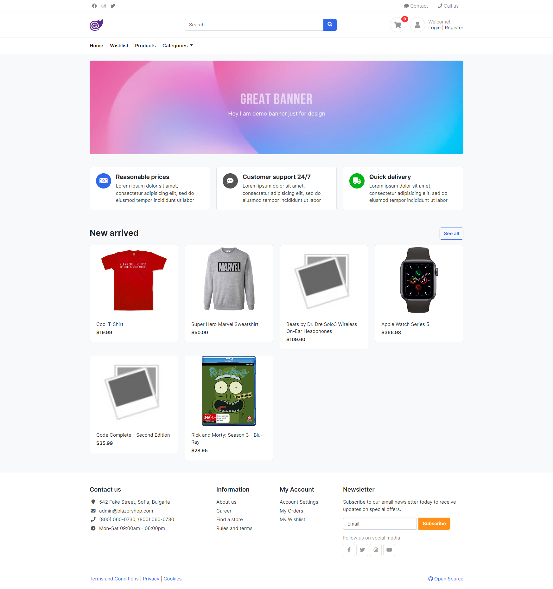
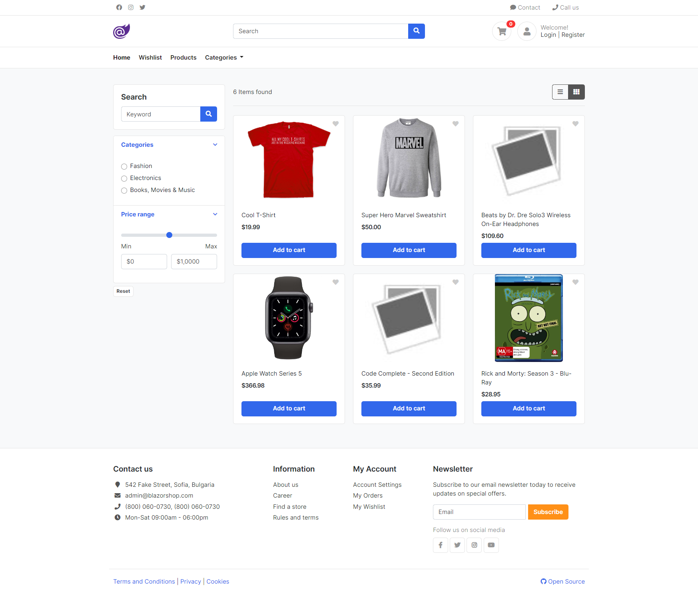

# BlazorShop
Fork from https://github.com/kalintsenkov/BlazorShop

已修改成支持`.NET6`。


# 如何使用

- 安装`MySQL`，我这里安装的是`MariaDB`。

- 修改`BlazorShop.Web.Server`项目的`appsettings.json`文件，正确配置数据库源。

- 执行数据库迁移命令：

  ```bash
  cd .\BlazorShop.Data
  dotnet ef --startup-project ..\BlazorShop.Web.Server database update
  ```

- 运行。运行效果图如下。

首页：



产品列表：



# 项目依赖关系

| 项目                  | 说明                                                         | 依赖                                         |
| --------------------- | ------------------------------------------------------------ | -------------------------------------------- |
| BlazorShop.Common     | 通用基础类和操作，与**业务无关**。                           | 无                                           |
| BlazorShop.Data       | 最基本的**业务相关**的数据结构；初始化数据；数据库迁移文件（可手动重新生成）。 | 无                                           |
| BlazorShop.Models     | 封装了一层的请求及响应的Model。**业务相关**。                | BlazorShop.Data   和 BlazorShop.Common       |
| BlazorShop.Web.Client | Web Assembly客户端项目。                                     | BlazorShop.Models                            |
| BlazorShop.Web.Server | 服务端项目。                                                 | BlazorShop.Services 和 BlazorShop.Web.Client |
| BlazorShop.Tests      | 测试服务端接口的测试工程。                                   | BlazorShop.Web.Server                        |

